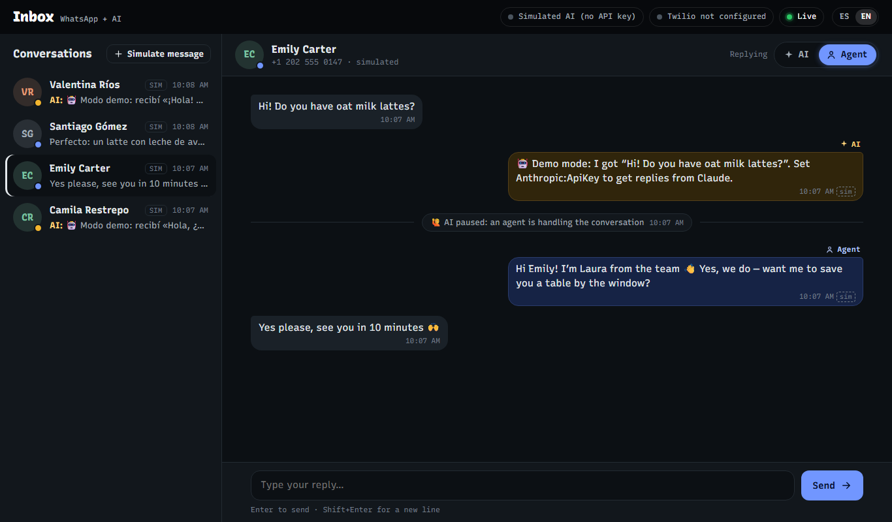
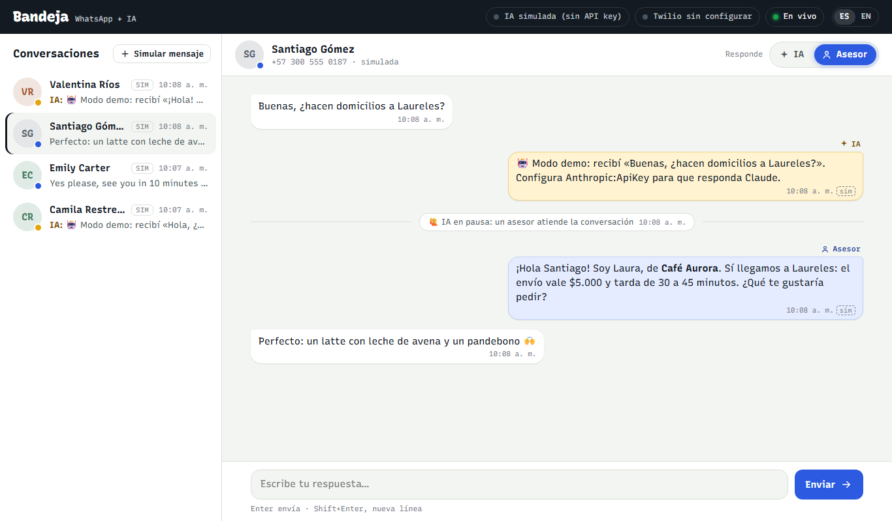
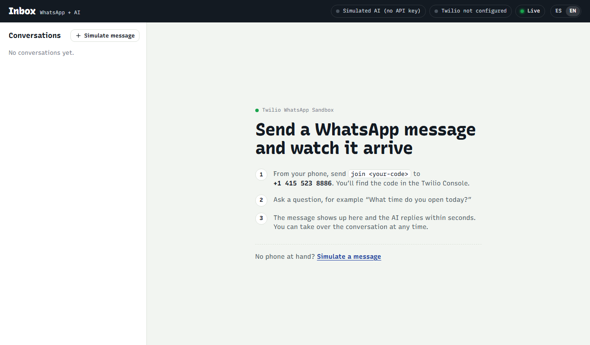
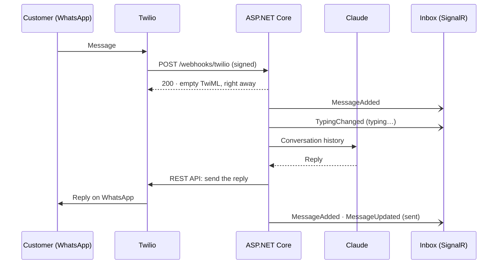

# WhatsApp AI Inbox

🇪🇸 [Leer en español](README.md)

[](https://github.com/MateoVH/WhatsAppDemo/actions/workflows/ci.yml)


A minimal **ASP.NET Core (.NET 10)** demo: messages sent to the **Twilio** WhatsApp sandbox are answered by **Claude** and show up instantly in a **real-time web inbox powered by SignalR**. A human agent can take over any conversation with one click.



<details>
<summary>More screenshots</summary>





</details>

## What's inside

- **Twilio webhook** that verifies the `X-Twilio-Signature` header.
- **Replies from Claude** (official Anthropic .NET SDK) generated in the background, so the webhook answers in milliseconds.
- **Real-time inbox** with SignalR: new messages, a "typing…" indicator and delivery status.
- **AI ⇄ agent handoff**: every conversation has a *Replying: AI | Agent* switch. When an agent writes, the AI pauses on its own; when it's turned back on, it answers whatever was left pending.
- **Spanish and English UI** (ES | EN switch). The AI replies in the customer's language.
- **Simulator** to try everything without a phone or credentials.

## How it works



## Try it in one minute (no credentials)

```bash
git clone https://github.com/MateoVH/WhatsAppDemo.git
cd WhatsAppDemo
dotnet run --project src/WhatsAppDemo
```

Open <http://localhost:5080> and click **Simulate message**. Without an API key, the AI answers in demo mode and nothing is sent through WhatsApp.

## Connect it to real WhatsApp

You need the [.NET 10 SDK](https://dotnet.microsoft.com/download), a [Twilio](https://www.twilio.com/try-twilio) account, an [Anthropic](https://console.anthropic.com/) API key and [ngrok](https://ngrok.com/) (or any HTTPS tunnel).

1. **Turn on the WhatsApp sandbox** in the Twilio Console (*Messaging → Try it out → Send a WhatsApp message*) and join it from your phone by sending `join <your-code>` to +1 415 523 8886.
2. **Store your credentials** with user-secrets (never in `appsettings.json`):

   ```bash
   cd src/WhatsAppDemo
   dotnet user-secrets set "Anthropic:ApiKey" "sk-ant-..."
   dotnet user-secrets set "Twilio:AccountSid" "AC..."
   dotnet user-secrets set "Twilio:AuthToken" "..."
   ```

3. **Start the app** and, in another terminal, **open the tunnel**:

   ```bash
   dotnet run
   ngrok http 5080
   ```

4. In the sandbox settings, paste `https://<your-subdomain>.ngrok-free.app/webhooks/twilio` into **When a message comes in**, with method `POST`.
5. Message the sandbox from WhatsApp and watch the inbox at <http://localhost:5080>.

> The inbox only opens from `localhost`: through the tunnel, only the webhook is reachable. See [Security](#security).

## Configuration

| Key | Default | What it does |
|---|---|---|
| `Anthropic:ApiKey` | — | Anthropic API key (`ANTHROPIC_API_KEY` works too). Without it, demo mode. |
| `Anthropic:Model` | `claude-opus-5-5` | Claude model. |
| `Anthropic:Effort` | `low` | Effort level. `low` gives fast replies, a good fit for chat. |
| `Anthropic:MaxTokens` | `4096` | Token cap per reply. |
| `Anthropic:SystemPromptFile` | `Prompts/system-prompt.md` | Assistant instructions and business details. |
| `Anthropic:TimeZone` | `America/Bogota` | The business's local time, to answer "are you open?". |
| `Twilio:AccountSid`, `Twilio:AuthToken` | — | Twilio credentials. Without them, outgoing messages are simulated. |
| `Twilio:WhatsAppFrom` | `whatsapp:+14155238886` | Sender of the replies (the sandbox number). |
| `Twilio:WebhookUrl` | — | Exact public webhook URL, if your tunnel doesn't send `X-Forwarded-Host`. |
| `Inbox:LocalOnly` | `true` | Only allows the inbox to be used from `localhost`. |
| `Inbox:HistoryLimit` | `20` | Recent messages the AI receives as context. |

For environment variables, use `__` instead of `:` (for example, `Twilio__AuthToken`).

## Customize the assistant

The behavior lives in [`Prompts/system-prompt.md`](src/WhatsAppDemo/Prompts/system-prompt.md). Out of the box it's Aurora, the assistant of Café Aurora, a fictional coffee shop in Medellín, Colombia, with opening hours, a menu and deliveries. The prompt is written in Spanish, but the assistant replies in the customer's language. Replace it with your own business details and restart the app.

## Project layout

```text
src/WhatsAppDemo
├── Program.cs                composition root and HTTP pipeline
├── Ai/                       Claude, demo mode and the background reply worker
├── Inbox/                    in-memory state, use cases, SignalR hub and REST API
├── WhatsApp/                 webhook, signature check and sending through Twilio
├── Prompts/system-prompt.md  assistant instructions
└── wwwroot/                  web inbox: HTML, CSS and JS, no build step
tests/WhatsAppDemo.Tests      xUnit + WebApplicationFactory
```

## Design decisions

- **Fast webhook, AI in the background.** The webhook stores the message and returns empty TwiML; the reply goes out later through Twilio's REST API. It never gets close to Twilio's 15-second timeout, and the inbox can show "typing…".
- **A single consumer** (`Channel<T>` + `BackgroundService`) prevents duplicate replies. If the customer writes while the AI is generating, the next reply follows with the context in the right order.
- **Claude at `low` effort with server-side fallback** (`fallbacks: "default"`): if the model declines for safety-policy reasons, the API retries with its fallback model; if that also declines, the conversation is left for an agent.
- **The server sends codes, not text.** Notes and errors are translated in the browser, so everyone sees the inbox in their own language.
- **In memory on purpose.** It's a demo: for production, replace `InboxStore` with a database.

## Security

- The Twilio signature is verified on every webhook; a mismatch returns `403`.
- The inbox has no login, so by default it only answers `localhost` (`Inbox:LocalOnly`). If you deploy it, add authentication before turning that option off.
- Secrets live in user-secrets or environment variables; `appsettings.json` has none.

## Tests

```bash
dotnet test
```

They cover the signed webhook (and invalid signatures), duplicate retries, agent takeover, the simulator, blocking requests that arrive through the tunnel, SignalR events and the exact request sent to Claude, without touching the network.

## Demo limits

- State lives in memory and is lost on restart.
- Text only: attachments show up as a placeholder.
- More than 24 hours after the customer's last message, WhatsApp requires approved templates; the message is marked as failed with Twilio's error.
- The Twilio sandbox only delivers to numbers that joined with `join`.

## License

[MIT](LICENSE)
