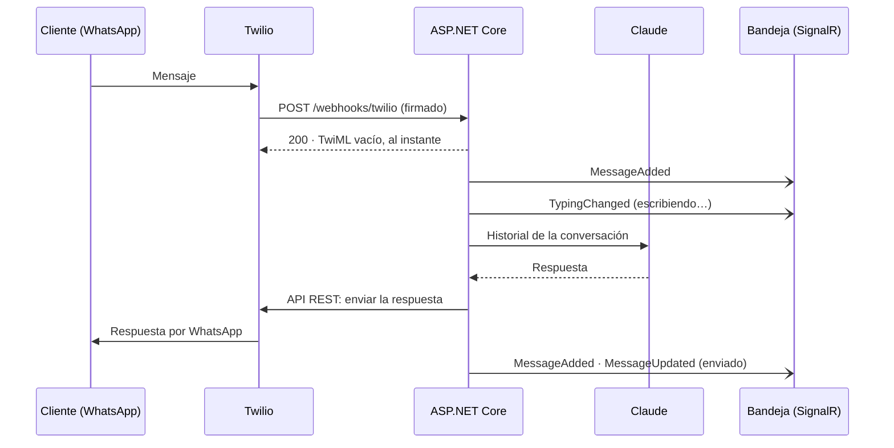

# Bandeja de WhatsApp con IA

🇬🇧 [Read this in English](README.en.md)

[](https://github.com/MateoVH/WhatsAppDemo/actions/workflows/ci.yml)


Demo mínima en **ASP.NET Core (.NET 10)**: los mensajes que llegan al sandbox de WhatsApp de **Twilio** los responde **Claude** y aparecen al instante en una **bandeja web en tiempo real con SignalR**. Un asesor puede tomar cualquier conversación con un clic.


<details>
<summary>Más capturas</summary>


</details>

## Qué incluye

- **Webhook de Twilio** con verificación de la firma `X-Twilio-Signature`.
- **Respuestas con Claude** (SDK oficial de Anthropic para .NET) generadas en segundo plano: el webhook contesta en milisegundos.
- **Bandeja en tiempo real** con SignalR: mensajes nuevos, indicador «escribiendo…» y estado de entrega.
- **IA ⇄ asesor**: cada conversación tiene un selector *Responde: IA | Asesor*. Si un asesor escribe, la IA se pausa sola; al reactivarla, responde lo que quedó pendiente.
- **Interfaz en español e inglés** (selector ES | EN). La IA responde en el idioma del cliente.
- **Simulador** para probar todo sin teléfono y sin credenciales.

## Cómo funciona



## Pruébalo en un minuto (sin credenciales)

```bash
git clone https://github.com/MateoVH/WhatsAppDemo.git
cd WhatsAppDemo
dotnet run --project src/WhatsAppDemo
```

Abre <http://localhost:5080> y pulsa **Simular mensaje**. Sin API key, la IA responde en modo demo y nada sale por WhatsApp.

## Conéctalo a WhatsApp de verdad

Necesitas el [SDK de .NET 10](https://dotnet.microsoft.com/download), una cuenta de [Twilio](https://www.twilio.com/try-twilio), una API key de [Anthropic](https://console.anthropic.com/) y [ngrok](https://ngrok.com/) (o cualquier túnel HTTPS).

1. **Activa el sandbox de WhatsApp** en la consola de Twilio (*Messaging → Try it out → Send a WhatsApp message*) y une tu teléfono enviando `join <tu-código>` al +1 415 523 8886.
2. **Guarda las credenciales** con user-secrets (nunca en `appsettings.json`):

   ```bash
   cd src/WhatsAppDemo
   dotnet user-secrets set "Anthropic:ApiKey" "sk-ant-..."
   dotnet user-secrets set "Twilio:AccountSid" "AC..."
   dotnet user-secrets set "Twilio:AuthToken" "..."
   ```

3. **Arranca la app** y, en otra terminal, **abre el túnel**:

   ```bash
   dotnet run
   ngrok http 5080
   ```

4. En la configuración del sandbox, en **When a message comes in**, pega `https://<tu-subdominio>.ngrok-free.app/webhooks/twilio` con método `POST`.
5. Escríbele al sandbox desde WhatsApp y mira la bandeja en <http://localhost:5080>.

> La bandeja solo se abre desde `localhost`: a través del túnel únicamente se puede llegar al webhook. Detalles en [Seguridad](#seguridad).

## Configuración

| Clave | Por defecto | Para qué sirve |
|---|---|---|
| `Anthropic:ApiKey` | — | API key de Anthropic (también vale `ANTHROPIC_API_KEY`). Sin ella, modo demo. |
| `Anthropic:Model` | `claude-opus-5-5` | Modelo de Claude. |
| `Anthropic:Effort` | `low` | Nivel de esfuerzo. `low` da respuestas rápidas, ideal para chat. |
| `Anthropic:MaxTokens` | `4096` | Tope de tokens por respuesta. |
| `Anthropic:SystemPromptFile` | `Prompts/system-prompt.md` | Instrucciones y datos del negocio. |
| `Anthropic:TimeZone` | `America/Bogota` | Hora local del negocio, para responder «¿están abiertos?». |
| `Twilio:AccountSid`, `Twilio:AuthToken` | — | Credenciales de Twilio. Sin ellas, los mensajes salientes se simulan. |
| `Twilio:WhatsAppFrom` | `whatsapp:+14155238886` | Remitente de las respuestas (el número del sandbox). |
| `Twilio:WebhookUrl` | — | URL pública exacta del webhook, si tu túnel no envía `X-Forwarded-Host`. |
| `Inbox:LocalOnly` | `true` | Solo permite usar la bandeja desde `localhost`. |
| `Inbox:HistoryLimit` | `20` | Mensajes recientes que la IA recibe como contexto. |

En variables de entorno usa `__` en lugar de `:` (por ejemplo, `Twilio__AuthToken`).

## Personaliza el asistente

El comportamiento vive en [`Prompts/system-prompt.md`](src/WhatsAppDemo/Prompts/system-prompt.md). Por defecto es Aurora, la asistente de Café Aurora, una cafetería ficticia de Medellín con horarios, menú y domicilios. Reemplaza ese texto con los datos de tu negocio y reinicia la app.

## Estructura

```text
src/WhatsAppDemo
├── Program.cs                composición y pipeline HTTP
├── Ai/                       Claude, modo demo y el worker que responde en segundo plano
├── Inbox/                    estado en memoria, casos de uso, hub de SignalR y API REST
├── WhatsApp/                 webhook, verificación de firma y envío con Twilio
├── Prompts/system-prompt.md  instrucciones del asistente
└── wwwroot/                  bandeja web: HTML, CSS y JS, sin paso de build
tests/WhatsAppDemo.Tests      xUnit + WebApplicationFactory
```

## Decisiones de diseño

- **Webhook rápido, IA en segundo plano.** El webhook guarda el mensaje y devuelve un TwiML vacío; la respuesta sale después por la API REST de Twilio. Así nunca se acerca al timeout de 15 s de Twilio y la bandeja puede mostrar «escribiendo…».
- **Un único consumidor** (`Channel<T>` + `BackgroundService`) evita respuestas duplicadas. Si el cliente escribe mientras la IA genera, se responde a continuación con el contexto en el orden correcto.
- **Claude con esfuerzo `low` y respaldo del servidor** (`fallbacks: "default"`): si el modelo declina por políticas de seguridad, la API reintenta con su modelo de respaldo; si aun así declina, la conversación queda para un asesor.
- **El servidor envía códigos, no textos.** Notas y errores se traducen en el navegador, así cada persona ve la bandeja en su idioma.
- **En memoria a propósito.** Es una demo: para producción, reemplaza `InboxStore` por una base de datos.

## Seguridad

- La firma de Twilio se verifica en cada webhook; si no coincide, la respuesta es `403`.
- La bandeja no tiene inicio de sesión: por eso, por defecto, solo responde a `localhost` (`Inbox:LocalOnly`). Si la publicas, agrega autenticación antes de desactivar esa opción.
- Los secretos van en user-secrets o variables de entorno; `appsettings.json` no contiene ninguno.

## Tests

```bash
dotnet test
```

Cubren el webhook firmado (y las firmas inválidas), los reintentos duplicados, la toma de control por un asesor, el simulador, el bloqueo de peticiones que llegan por el túnel, los eventos de SignalR y la petición exacta que se envía a Claude, sin salir a la red.

## Límites de la demo

- El estado vive en memoria y se pierde al reiniciar.
- Solo texto: los adjuntos aparecen como un marcador.
- Pasadas 24 h desde el último mensaje del cliente, WhatsApp exige plantillas aprobadas; el mensaje se marca como fallido con el error de Twilio.
- El sandbox de Twilio solo entrega mensajes a los números que se unieron con `join`.

## Licencia

[MIT](LICENSE)
